<h2 align="left"></h2>

##### Click logo above to view live project


<h2 align="center">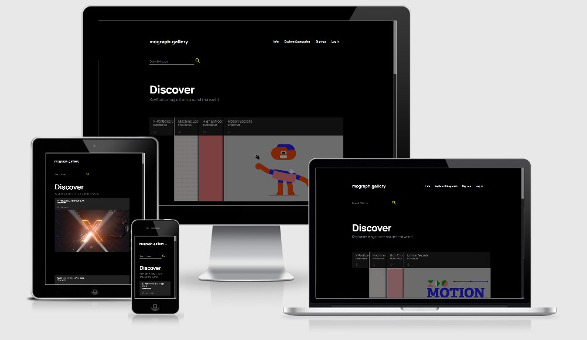</h2>

mograph.gallery is an online collection of motion graphics work. Motion graphics designers or motion designers as they are often called, take pride in showcasing their work online both for inspiration and also as a digital portfolio. Before now websites that served this purpose were either Vimeo(an online video-hub similar to youtube) or Behance(a more specialised portfolio hub for all creative professions). While these are very useful, there has not been a tailored platform for motion graphics work solely. This means an often tedious process is required to search for inspiration or just to see the latest trends available. The current platform for a large collection of motion design work is on Vimeo, but this exists amidst a lot of other videos and parsing through can often be quite time-consuming.

As a motion designer myself, my hope was to make a tool I would be willing to use in my creative process. I built mograph.gallery to be part of a daily workflow for motion designers who just want to access curated pieces quickly. Bearing in mind that Vimeo is the current platform where a majority of these videos currently exist. I tailored this website to be currently optimised for videos uploaded to Vimeo with a plan to add additional support in the future. Furthermore, with future updates, the profile section would include a fully-featured bio section where career information for each user would be included. Eventually, users would have a fully functional portfolio that they can present to employers and peers alike.


## User Experience (UX) 

- ### User Stories

  - #### First Time Visitor Goals

    a. As a First Time Visitor, I want to easily understand the main purpose of the site and sign up.  
    b. As a First Time Visitor, I want to be able to easily navigate throughout the site to find content.
    c. As a First Time Visitor, I want to easily find details about how to add a video.
    d. As a First Time Visitor, I want to be able to preview the videos in collections, in order to find specific videos.
    e. As a First Time Visitor, I want to be able to search through the videos using keywords to parse through the gallery.

  - #### Returning Visitor Goals

    a. As a Returning Visitor, I want to be able to easily log in after creating an account.  
    b. As a Returning Visitor, I want to be able to easily add a video, with easy steps and fields to help me input relevant information about my video, so others can locate it easily.

  - #### Frequent User Goals

    a. As a Frequent User, I want to find the videos uploaded by me, as well as information about how many videos I have uploaded.

* ### Design

  - #### Colour Scheme

    - The colour scheme across the website is a combination of black, greys white and yellow. The colours are used from Materialize's colour palette. The website is designed to be clean and easily present access to preview videos with just a hover as the gallery shuffles fluidly like a pack of cards. With the aid of material design provided by the framework materializecss. I built the website to feel familiar to designers who would appreciate the fluid motion and the subtle use of aesthetic influences from the Windows Explorer(the categories section uses familiar icons styles that are reminiscent of the folder icons from Windows 10) and OSX(the video preview in the categories section on larger screens). 

    The entire website has a black background with links being either white or grey depending on their function. Accents and active links, however, are yellow.
    <h4>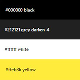</h4>


  - #### Typography
    - The Google font Manrope is the primary font used across the website, with Sans-serif as the alternative font for cases when the default options aren't loaded onto the website correctly.
      It is very legible and contrast on the dark background given a very modern and light feel to the website. In bold and larger sizes it is used as a page header and at it's smallest for copyright information. The variation of weight, size and colour helps to create a consistent flow across the document that is easy to read. 

- ### Wireframes

  Initial Wireframes developed at the start of the project are below:

- <h4>Home Page</h4>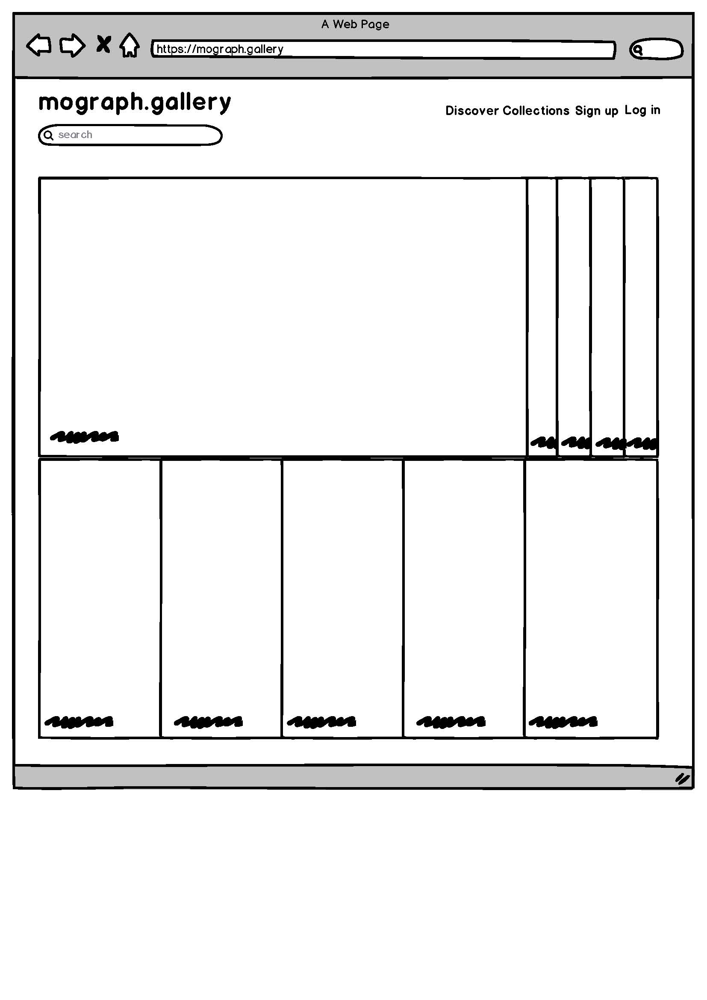
- <h4>Categories</h4>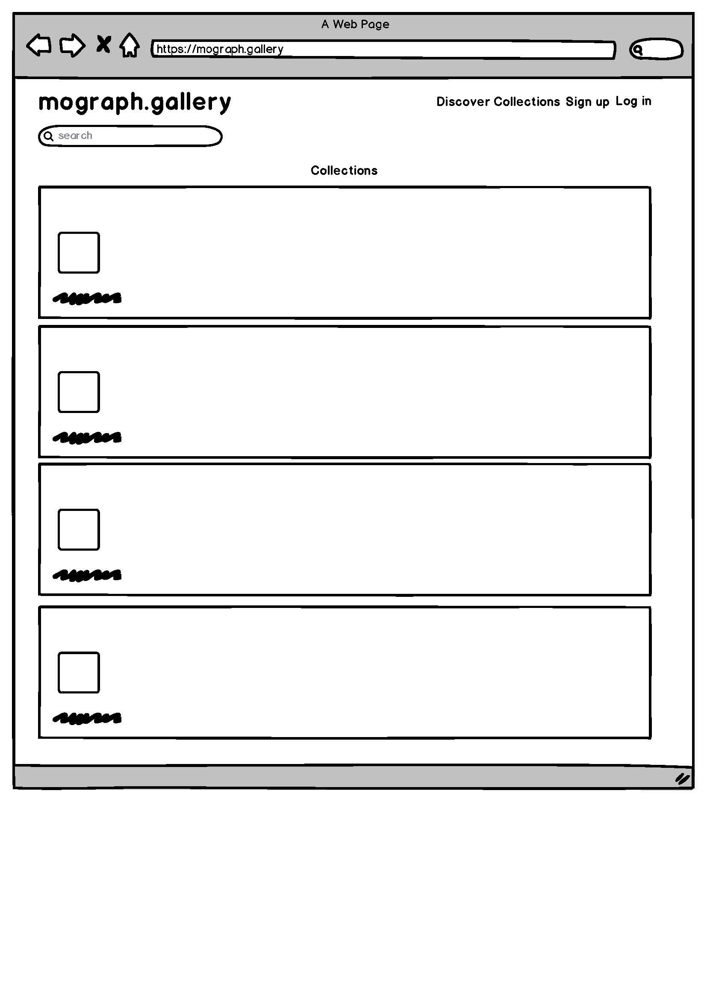


## Features

This section contains all the features of the website.

### Discover

This is the main section of the gallery and consists of all the videos uploaded by all users. 

- On page load, the user is presented with a navigation bar which shows a link to info on how to upload, all categories of videos upload and links either log in for existing account holders or signs up for prospective account holders. 
- If the user already has an account an additional link is visible to "Add a Video" to the database. 
- Additionally, if the user is the administrator of the site, the Explore Categories link becomes a Manage Categories link has an account an additional link is visible to "Add a Video" to the database. 
- Below this is a collection of all videos uploaded. Each video has a name, description and details about its creators and who uploaded it. 
- Below the video name, is an info icon hinting at "learn more" on hover for larger screens or with "learn more" beside it on smaller screens.  
- Upon activation, this icon reveals all the details provided by the uploader about each video.

- <h4>Navigation Bar</h4>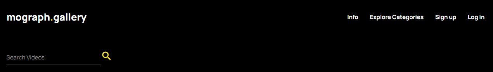
- <h4>Navigation Bar(Logged In)</h4>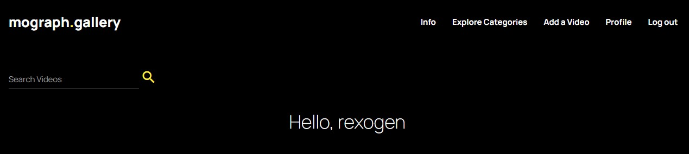
- <h4>Navigation Bar(Admin Only)</h4>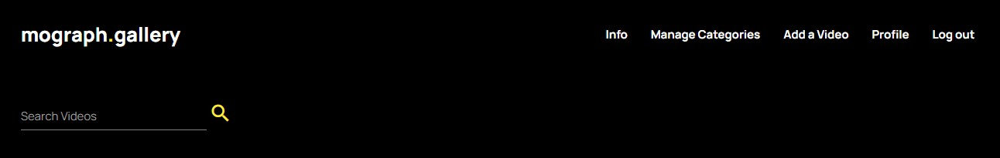

### Profile

This is a user-specific version of the gallery and consists of all the videos uploaded by the active user. 

- After login, the user sees a profile link on the navigation bar. With the user name as its header.
- Below the user name, is am indication of the number of videos currently uploaded by the active user, with a gallery of those videos underneath. 
- Furthermore, beside each video is an edit and delete button, which helps the user edit details of an already uploaded video or delete it entirely from the database. 

- <h4>Manage Videos</h4>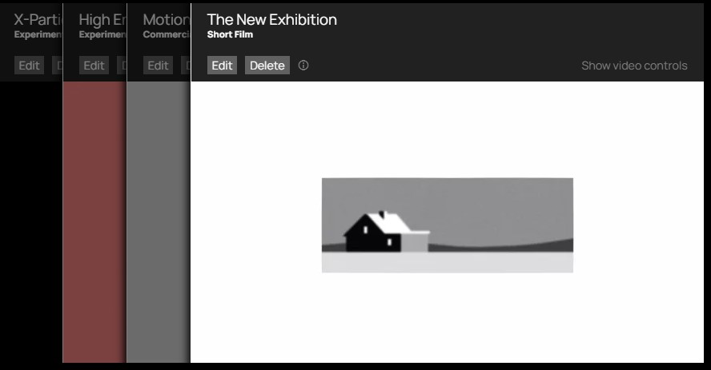
- <h4>Video Count</h4>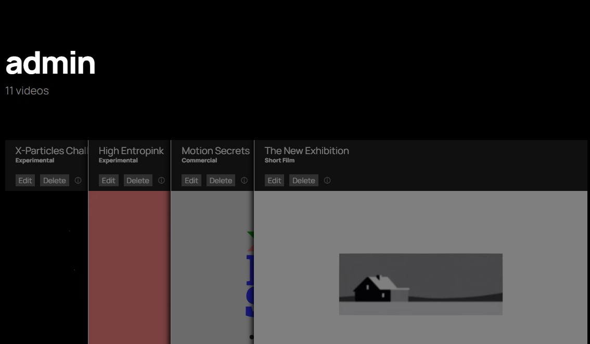

### Categories

This section provides a curated collection of all the videos on the site, pooled together into collections that are predetermined by the administrator of the site. New categories can be added and existing categories can be edited only by the site's administrator. The button to add a new category is also only available when the site's administrator is the active user.

- <h4>Category Folder</h4>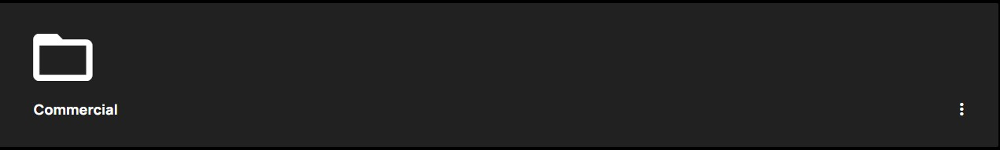
- <h4>Add Category(Admin Only)</h4>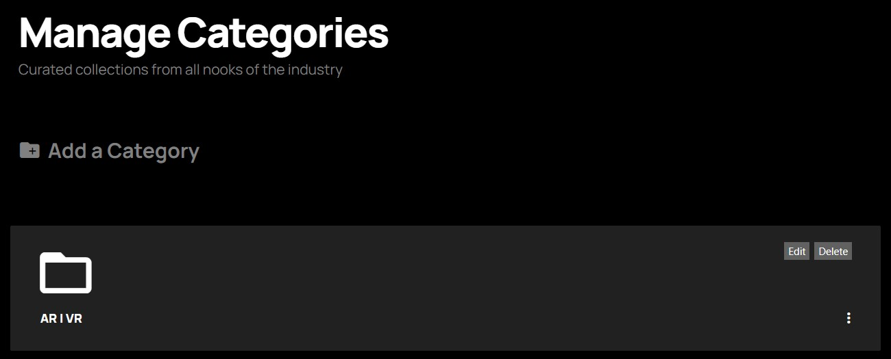
- <h4>Manage Category(Admin Only)</h4>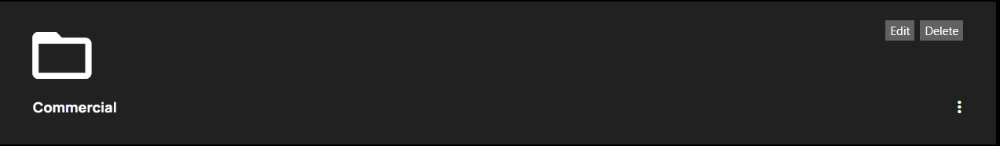
- <h4>Video Previews(Larger Screens Only)</h4>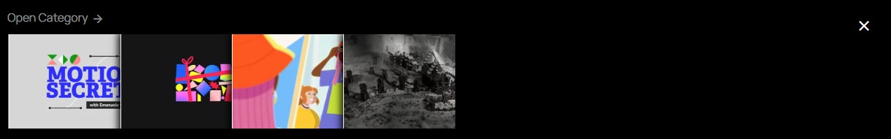

### Info

This how-to section contains a breakdown of steps to take when adding a video to the database.

- <h4>Tips to get you going</h4>

### Sign Up 

This link launches a modal with fields to create a username and password.

### Log in

This link launches a modal with fields to enter in a username and password.

### Database

All of the functionality above is made possible with the aid of a database that users access as they navigate through the site. 
There are three main dictionary collections for this site on MongoDB. These are Categories, Users and Videos.

- <h4>Screenshot showing all collections used on MongoDB</h4>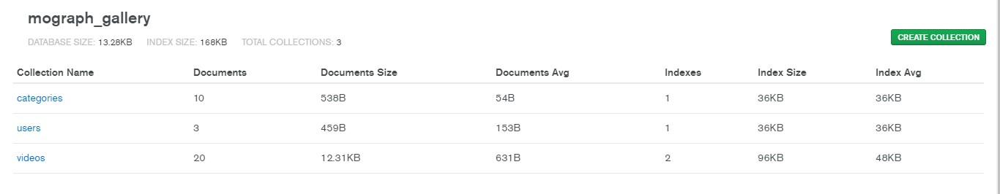

#### Categories
- The Categories collection contains key-value pairs that represent groupings for the various videos each user uploads, in addition to a unique ID for each category. This ID is essential to enable accurate access to each category from Python and Jinja.
These groups are created and can only be edited by the site's administrator, after editing, the collection is automatically updated to reflect those changes on MongoDB. On the website, this can be accessed on the "Explore Categories" or "Manage Categories" (admin only) pages. This is also used in the forms filled to add a video to the site as a required selection. Making sure that each video uploaded belongs to a category.

- <h4>Screenshot of Categories collection on MongoDB</h4>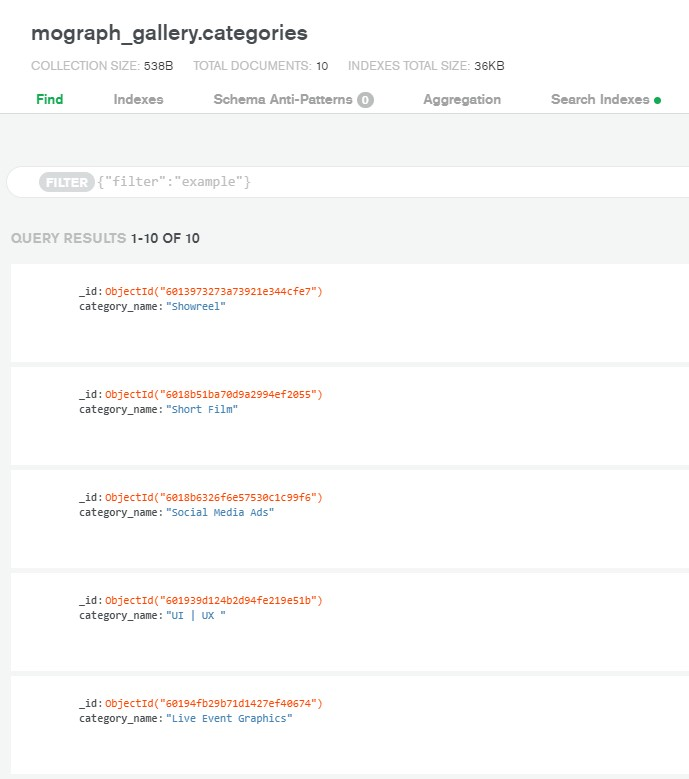

#### Users
- The Users collection contains key-value pairs that hold the login credentials for all users on the website. The keys present here are a unique ID per entry, the username and a hashed/salted version of each user's password. Password hashing is achieved with the help of werkzeug.security.

These credentials are created from the website during sign up and accessed during login. Certain features of the website are unique to each user based on the connection between this collection and the Videos collection described below. A primary example of this is in the User profile page which houses videos unique to each user.

- <h4>Screenshot of Users collection on MongoDB</h4>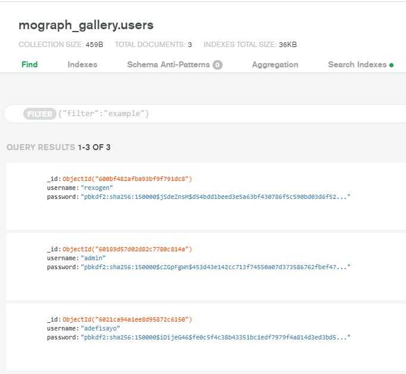

#### Videos
- The Video collection contains key-value pairs that describe the information about each video uploaded. This information is uploaded when the Add Video link is clicked on from the navbar and can be updated/deleted when the corresponding buttons for each video are clicked on from the Profile page. Information here is unique to each video and contains a unique ID, the video name, the category it belongs to its description, its creators, who uploaded it, and any tags the uploader would like to add to it, to make it more easily found in a search through the entire website. These tags could be words not present in the video name or its description but are relevant to the style of the video or its predominant technique. The "category_name" key here is used in conjunction with the category name key in the Categories collection. Additionally, the "added_by" key here is used in conjunction with the "username" key from the Users collection. These connections are essential to the organisation of the videos on the site enabling a personalised and curated experience for each user.

- <h4>Screenshot of Videos collection on MongoDB</h4>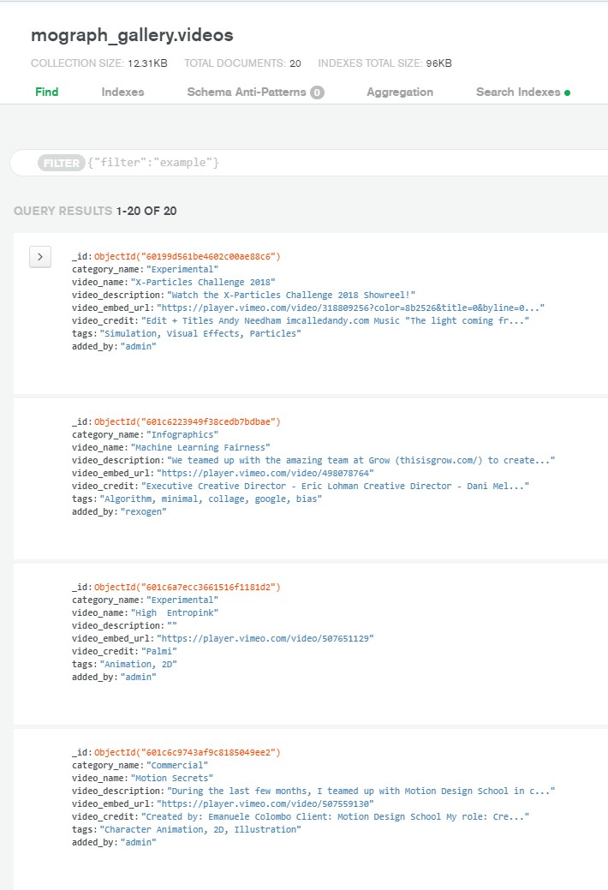

### Features Left to Implement

- A button that creates a colour palette from the unique to each video. 
- Add user-specific collections, enabling users to create folders of videos unique to their needs, this will be useful for personalized curation.
- More personalized information to the profile page comprising a bio, profile photo and professional details, which will enable the profile section to be used as a fully functional portfolio.

## Technologies Used

### Languages Used

- HTML5
- CSS3
- jQuery and Javascript
- Python
- Jinja                                                                                                                              

### Frameworks, Libraries & Programs Used

- [Materialize](https://materializecss.com/)

  - The game uses Materialize's library to aid responsiveness across various screen sizes and devices. The design of the website also benefits from the design aesthetics of Google's Material UI, which is design backbone for Materialize.

- [jQuery](https://jquery.com) and Javascript

  - Materialize includes jQuery, which is used in the navbar, modals, forms and tooltips across the website.
  - jQuery and Javascript are used to enable dynamic scrolling and activation of Vimeo's API.
  - Some responsive layout changes have also been implemented with Javascript.
 

- [Google Fonts](https://fonts.google.com/)

  - Google fonts were used to import the "Manrope" font into the style.css file which is used across the project.

- [Python](https://www.python.org/)

  - Python was used to manage the website's data and enable communication with MongoDB.

- [Jinja](https://jinja.palletsprojects.com/en/2.11.x/)

  - Jinja is a modern and designer-friendly templating language for Python.

- [werkzeug.security](https://werkzeug.palletsprojects.com/en/1.0.x/)

  - werkzeug.security is a Web Server Gateway Interface application library, that was used to enhance security with user password salting and hashing. 

- [MongoDB](https://fontawesome.com/)

  - MongoDB was used to provide a database to enable creating, editing, updating and deleting videos.

- [Git](https://git-scm.com/)

  - Git was used for version control by utilizing the Gitpod terminal to commit to Git and Push to GitHub.

- [GitHub](https://github.com/)

  - GitHub is used to store the project's code after being pushed from Git.

- [Heroku](https://www.heroku.com/)

  - Heroku is used to deploy the website.

- [Balsamiq](https://balsamiq.com/)

  - Balsamiq was used to create the wireframes during the design process.

- [Froogaloop](https://f.vimeocdn.com/js/froogaloop2.min.js)

  - Vimeo's froogaloop API was used to facilitate the triggering and listening of basic player methods.


## Testing

The implementation of the website's structure with Jinja provided an easy way to access the dictionaries available on MongoDB, which were essential in building the templates across the site. However. the fact that jinja is executed only at page load and can only communicate with python, meant that in creating mobile versions of the site, I had to duplicate certain positions of the code and utilizing media queries, I switched between the versions of the websites depending on the screen size. 

The W3C CSS Validator Services was used to validate the style.css page to ensure there were no syntax errors in the code. No errors were found during the validation process.

- [W3C CSS Validator](https://jigsaw.w3.org/css-validator/#validate_by_input)

  <a href="static/img/w3c_css_validator_results.pdf" download>Download results here</a>


### Testing User Stories from User Experience (UX) Section

- #### First Time Visitor Goals

  1. As a First Time Visitor, I want to easily understand the main purpose of the site and sign up.

     - Upon entering the site, users are automatically greeted with a clean and easily readable navigation bar with the name of the website, which is quite descriptive of its purpose.
     - The website is optimised for use with larger screens but also has a well-considered mobile version. The animation and previewing options for the videos are specifically tailored for the website's main purpose which is quickly accessing motion design inspiration and content.
     - There is a link on the navbar to sign up, by creating a unique username and password.

  2. As a First Time Visitor, I want to be able to easily navigate throughout the site to find content.

     - The site has been designed to be minimal with little distraction to its main focus which is the gallery. Videos are enabled with an autoplay feature and animation which highlights the currently hovered video. Additionally, the description information about the videos is easily accessible on larger screens in the same way.

  3. As a First Time Visitor, I want to easily find details about how to add a video.

     - The info link on the navbar provides a list of tips that tell the user how to go about adding a video in easy steps.

  4. As a First Time Visitor, I want to be able to preview the videos in collections, in order to find specific videos.

     - Besides the Info link is an "Explore Categories" which presents the videos on the homepage in a collection of predefined folders that are representative of the major areas of focus of the field of motion graphic design. As user add videos to the site they are automatically collated into these categories for easy curation. 

  5. As a First Time Visitor, I want to be able to search through the videos using keywords to parse through the gallery.

     - There is a search field underneath the navbar, that enables keyword searches which are indexed using the name of each video, its description, name of its creators and the tags that can be provided at the time of upload.  

- #### Returning Visitor Goals

  1. As a Returning Visitor, I want to be able to easily log in after creating an account.

     - There is a link on the navbar to log in to an existing account, using the login credentials created during signup.

  2. As a Returning Visitor, I want to be able to easily add a video, with easy steps and fields to help me input relevant information about my video, so others can locate it easily.

     - There is a link on the navbar to add a video, which launches a modal with a collection of fields to enable the user to add information about the video being uploaded.

* #### Frequent User Goals

  1. As a Returning Visitor, I want to be able to easily log in after creating an account.

     - There is a link on the navbar to log in to an existing account, using the login credentials created during signup.

### Further Testing

- The Website was tested on Google Chrome, Internet Explorer, Microsoft Edge and Safari browsers.
- The website was viewed on a variety of devices such as Desktop, Laptop, Samsung Galaxy Note 10, Samsung S9 & iPhone8, iPhone 12 and iPhone 12 mini.
- A large amount of testing was done to ensure that all the levels work correctly. Details below

| Test                                     | Actions Taken                                                                                                                            | Expected Outcome                                 | Result                                                                                                                                                                                                                       |
| ---------------------------------------- | ---------------------------------------------------------------------------------------------------------------------------------------- | ------------------------------------------------ | ---------------------------------------------------------------------------------------------------------------------------------------------------------------------------------------------------------------------------- |
| Responsiveness                           | Multiple devices on different operating systems were used with Safari, Chrome and Firefox                                                | Consistent Layout, behaviour and Icons           | I noticed certain inconsistencies on the category selection field on iOS, which I fixed with jQuery                                                                                                                      |
| Video gallery   | Testing the response of the hover/autoplay feature on mobile phones                                                             | Consistent behaviour and user experience across devices providing easy access to videos                     | I noticed that the video previews were impractical on smaller screens and additionally because the hover effect is not feasible on mobile devices. I decided to remove that feature for mobile devices. Replacing it with click-based access to open the category when the folder icon is clicked.                                                                                                                                                                                              |
| CRUD(Create, read, update and delete) functionality on videos                    | Testing with over 20 videos with both an admin and a user accounts | Consistent and effective uploading to MongoDB and website                                                                                                                                                                                                     | Yes, it worked perfectly
| CRUD functionality on categories | Testing with various categories both for adding, editing and delete categories                                                      | Consistent behaviour with stress testing         | I noticed my initial implementation of editing the categories didn't factor in the existence of the same name in the category database. I fixed this by including a string comparison in Python. |

- Friends and family members were asked to review the site and documentation to point out any bugs and/or user experience issues.
- Additional automated testing was done using [Browser Stack](https://live.browserstack.com/) and [Am I Responsive](http://ami.responsivedesign.is/?url=https%3A%2F%2Fmograph-gallery-project.herokuapp.com%2F).

## Deployment

### Heroku

The project was deployed to Heroku using the following steps...

1. Log in to Heroku and locate the [project](https://dashboard.heroku.com/apps/mograph-gallery-project) on the dashboard.
2. On the Deploy tab authenticate with GitHub. You only have to do this once per Heroku account. Be sure to select the [GitHub repository](https://github.com/Rexayo/mograph.gallery).
3. After the authentication is complete and all the appropriate Config Vars have been entered.
4. Under "Domains", locate the now published site [link]( https://mograph-gallery-project.herokuapp.com/).


### Making a Local Clone on GitHub

1. Log in to GitHub and locate the [GitHub Repository](https://github.com/Rexayo/mograph.gallery/)
2. Under the repository name, click "Clone or download".
3. To clone the repository using HTTPS, under "Clone with HTTPS", copy the link.
4. Open Git Bash
5. Change the current working directory to the location where you want the cloned directory to be made.
6. Type `git clone`, and then paste the URL you copied in Step 3.

```
$ git clone https://github.com/Rexayo/mograph.gallery/
```

7. Press Enter. Your local clone will be created.

```
$ git clone https://github.com/Rexayo/mograph.gallery.git
Cloning into 'mograph.gallery'...
remote: Enumerating objects: 140, done.
remote: Counting objects: 100% (140/140), done.
remote: Compressing objects: 100% (83/83), done.
Receiving objects:  90% remote: Total 329 (delta 73), reused 109 (delta 44), pack-reused 189
Receiving objects: 100% (329/329), 82.67 MiB | 6.53 MiB/s, done.
Resolving deltas: 100% (153/153), done.
```

Click [Here](https://help.github.com/en/github/creating-cloning-and-archiving-repositories/cloning-a-repository#cloning-a-repository-to-github-desktop) to retrieve pictures for some of the buttons and more detailed explanations of the above process.

## Credits

### Code

- [Materialize](https://materializecss.com/): Bootstrap Library was used throughout the project mainly to make the website responsive using the Bootstrap Grid System.

- [HTML & CSS](https://www.w3schools.com/): I researched a lot of code support from W3 Schools. Additional research on CSS was done on [CSS Tricks](https://css-tricks.com/). Base code for gallery layout was gotten from [Code Pen](https://codepen.io/gaeowyn/pen/oiyHF).

- [jQuery](https://codeinstitute.net/)-Validation of select fields on forms was done with JQuery code provided by Code Institute.

- Code Pen - Base code for gallery layout was gotten from [Code Pen](https://codepen.io/gaeowyn/pen/oiyHF).
- Stack Overflow
  - [Scroll to Top](https://codepen.io/deveb22/pen/QxPmGz).
  - [Autocenter active video description](https://stackoverflow.com/questions/35992900/bootstrap-accordion-scroll-to-top-of-active-open-accordion-on-click).
- Froogaloop - [Event triggering for Vimeo videos](https://stackoverflow.com/questions/35549780/play-vimeo-videos-on-mouse-hover).

## Credits

### Acknowledgements
- My Mentor for continuous helpful feedback.
- I received inspiration for this project from a website called [Design Inspiration](https://www.designspiration.com/). Much of functionality is also based on [Pinterest](https://www.pinterest.co.uk/) and [Behance](https://www.behance.net/) with the added bonus being that mograph.gallery has features tailored to the niche sector of the motion graphics whilst all the other are catering to a much larger audience.